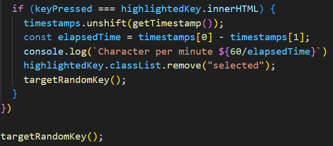

## Keyboard Hero HTML - CSS - JS

feat: Add functions to manage random key selection and timestamps

- Initialize `keys` array with letters A-Z
- Create an empty `timestamps` array
- Add initial timestamp to `timestamps` using `getTimestamp` function
- Implement `getTimestamp` to return the current time in seconds
- Implement `getRandomNumber` to generate a random integer between a given min and max
- Implement `getRandomKey` to return a random key from the `keys` array
- Implement `targetRandomKey` to add "selected" class to a random key element and record the start time
- Fix typo in `getRandomKey` function (`lenght` to `length`)

feat: Add timing and feedback for correct key presses

- Check if pressed key `matches` the highlighted `key`
- Add new `timestamp` for correct `key` presses
- Calculate and log characters `per minute`
- Remove `selected` class from correctly pressed `key`
- Highlight a new random `key`
- Initialize first random `key` highlight on `load`
